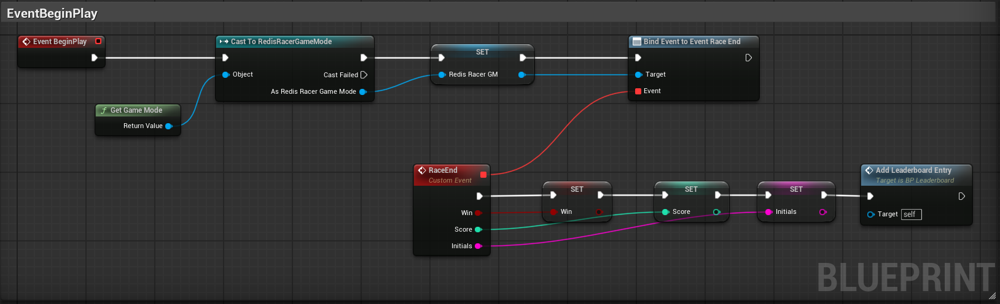
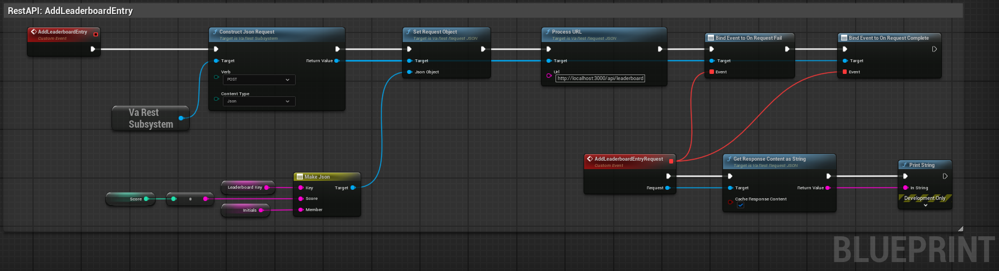
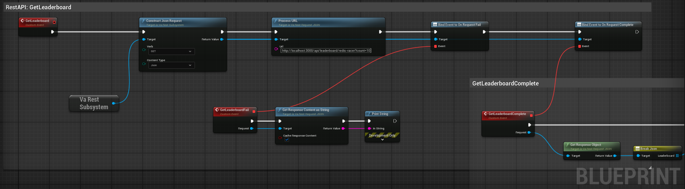
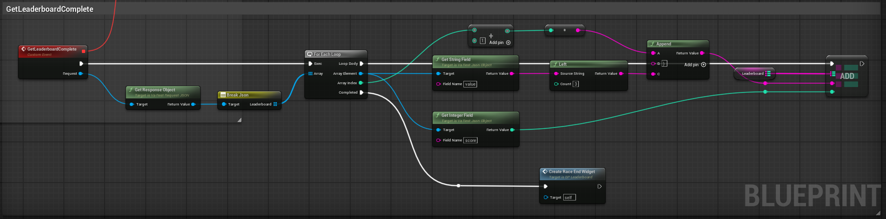
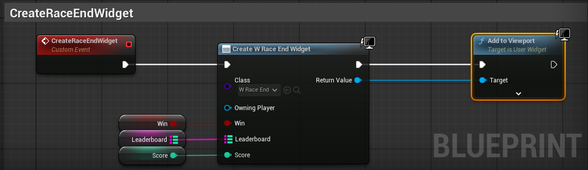

This is a game backend starter project for creating real-time leaderboards using:

- [Unreal Engine 5](https://www.unrealengine.com)
- [Redis](https://redis.io/try-free/)
- [Express](https://expressjs.com/)

Watch the [tutorial](https://www.youtube.com/watch?v=2UhkGLJpM_s) on YouTube!

## Create Environment Variables

Copy and edit the `.env` file:

```bash
cp .env.example .env
```

Your `.env.docker` file will look similar to `.env`, but should use the appropriate docker internal URLs. Here is
an example:

```bash
REDIS_URL="redis://redis:6379"
```

## Run Game Backend Locally

Spin up docker containers:

```bash
docker compose up -d
```


Alternatively, you can run the development server outside of docker:

```bash
npm install
# then
npm run dev
```

## RestAPI Routes
You should have a server running on `http://localhost:<port>` where the port is set in your `.env` file (default is 3000). You can test the following routes:

1. `POST http://localhost:<port>/api/leaderboard` - Add new entry to leaderboard sorted set, requires content body:

   ```
   {
      "key": <leaderboard_key>,
      "score": <score>,
      "member": <initials>
   }
   ```

2. `GET http://localhost:<port>/api/leaderboard/<leaderboard_key>?count=<number_of_entries>` - Get the top scores and the corresponding initials.


## Setup Leaderboard Blueprint in UE5

#### **Add VaRest plugin**

1. Claim the [VaRest plugin](https://www.fab.com/listings/d283e40c-4ee5-4e73-8110-cc7253cbeaab) in the Fab Marketplace  
2. In the Epic Launcher, install the plugin to UE.  
3. Open the RedisRacer project.  
4. Go to Edit → Plugins  
5. Search for VARest  
6. Tick the checkbox to enable the plugin and restart the editor.

#### **Create the BP\_Leaderboard blueprint**

1. In the Content Browser, create a new blueprint actor named BP\_Leaderboard.  
2. In the Event Graph, create 3 custom events:  
   1. AddLeaderboardEntry,  
   2. GetLeaderboard, and  
   3. CreateRaceEndWidget  
3. For EventBeginPlay,  
   1. Get the game mode, cast it to RedisRacerGameMode and promote it to variable.  
   2. From the RedisRacerGameMode, bind event to event RaceEnd  
   3. Create a custom event called RaceEnd  
   4. Promote win, score, and initials to variables.  
   5. Call the AddLeaderboardEntry event.




4. AddLeaderboardEntry ⇒ RestAPI call to update leaderboard  
   1. For the AddLeaderboardEntry, we’ll use the VARest subsystem  
   2. ConstructJsonRequest  
      1. It will be a POST API call with Json as the ContentType  
   3. From the return value of the Json Request, we will find SetRequestObject  
      1. Drag out from the JsonObject and MakeJson  
      2. Add 3 string elements to the JsonObject  
         1. key,  
         2. score, and  
         3. member  
   4. Create a new variable and name it LeaderboardKey, remember to compile and input the leaderboard key name later.  
   5. Connect the variables, LeaderboardKey, Score, and Initials to the MakeJson node.  
   6. Drag out from the return value of the ConstructJsonRequest and find ProcessURL  
      1. The URL will be http://localhost:3000/api/leaderboard  
   7. From the return value of the ConstructJsonRequest find BindEventToOnRequestComplete and BindEventToOnRequestFail  
   8. We will create one custom event for both of these events.  
      1. GetResponseContentAsString and connect it to a PrintString
      1. Then call the GetLeaderboard event. 




5. GetLeaderboard ⇒ RestAPI call to retrieve leaderboard  
   1. Use the VARest subsystem.  
   2. ConstructJsonRequest  
      1. The verb is GET and ContentType is Json  
   3. From the return value, find ProcessURL  
      1. I’ll copy the URL from our testing in Postman  
   4. From the return value of the ConstructJsonRequest find BindEventToOnRequestFail and BindEventToOnRequestComplete, but this time we will create two separate custom events.  
   5. GetLeaderboardFail, will be the same GetResponseContentAsString connected to a PrintString for debugging.




6. For GetLeaderboardComplete  
   1. Connect GetResponseObject to a BreakJson  
   2. Add one element named “leaderboard” (all lowercase), and it is an array of objects.  
   3. From the array of objects, get a ForEachLoop, for each array element:  
      1. GetStringField with the FieldName of “value”  
      2. GetIntegerField with the FieldName of “score”  
   4. For the string field  
      1. We’ll take a left with count 3, this is to get just the player initials  
      2. We will then append the array index \+ 1 to designate the player rank on our leaderboard.  
   5. Create a Leaderboard variable with the type of string:integer map to store the results from the GetLeaderboard API call.  
      1. Get a reference to the Leaderboard variable we just created and find Add to add entries.  
      2. Plug in the StringField result and the IntegerField into the Leaderboard.  
   6. When the ForEachLoop is completed, call CreateRaceEndWidget



7. CreateRaceEndWidget  
   1. CreateWidget, find W\_RaceEnd  
   2. Connect the Win, Leaderboard, and Score variables to the input of the W\_RaceEnd Widget.  
   3. Then add the widget to viewport.



8. Compile and set the default value for the LeaderboardKey variable, which is “redis-racer” for this tutorial.  
9. Add the BP\_Leaderboard blueprint to the level, and test play\!


## Connecting to Redis Cloud

If you don't yet have a database setup in Redis Cloud [get started here for free](https://redis.io/try-free/).

To connect to a Redis Cloud database, log into the console and find the following:

1. The `public endpoint` (looks like `redis-#####.c###.us-east-1-#.ec2.redns.redis-cloud.com:#####`)
1. Your `username` (`default` is the default username, otherwise find the one you setup)
1. Your `password` (either setup through Data Access Control, or available in the `Security` section of the database
   page).

Combine the above values into a connection string and put it in your `.env` and `.env.docker` accordingly. It should
look something like the following:

```bash
REDIS_URL="redis://default:<password>@redis-#####.c###.us-west-2-#.ec2.redns.redis-cloud.com:#####"
```


## Learn more

To learn more about Redis, take a look at the following resources:

- [Redis Documentation](https://redis.io/docs/latest/) - learn about Redis products, features, and commands.
- [Learn Redis](https://redis.io/learn/) - read tutorials, quick starts, and how-to guides for Redis.
- [Redis Demo Center](https://redis.io/demo-center/) - watch short, technical videos about Redis products and features.
